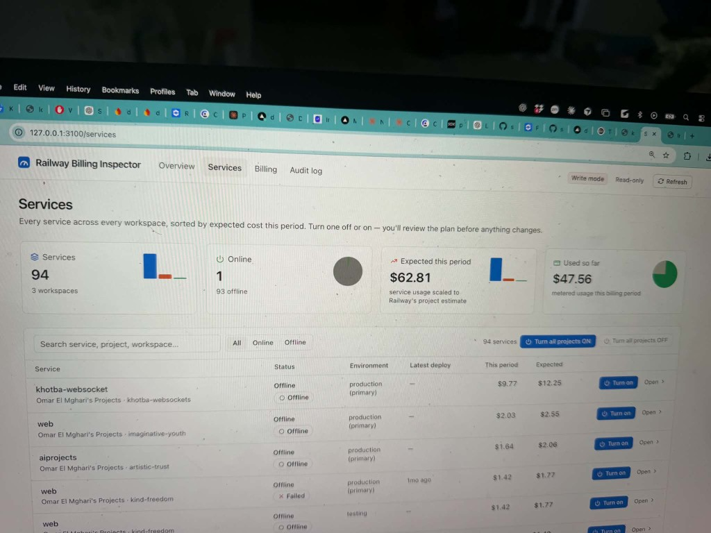

# Railway Billing Inspector

A local Next.js dashboard for your Railway account(s). See every project and its status across your Hobby and Pro workspaces, drill down to services and deployments, check usage and billing, and clean things up. Nothing changes until you have reviewed and approved it.

**See it in action:** [railway-billing-inspector.vercel.app](https://railway-billing-inspector.vercel.app) — demo data only, nothing is sent to Railway. For your own account, run it locally with a token (below).

## Why I built this

I was looking at my recent Railway bills — almost **$120 a month** across **94 projects**. Not all of them needed to be running every day. Taking them down one by one in Railway's own dashboard was a painful process, so I used Claude and Cursor to build this Next.js app.

With it I took every project offline in one click, then turned back on only the ones I still needed.



- **Overview.** Every workspace and project with live, crashed, failed and sleeping counts, cost this period, projected cost, and a "Worth a look" list: crashed services, failed deploys, forgotten PR environments, and projects with nothing live that still cost money.
- **Project.** Cost by service and by resource, a service table for each environment, volumes, and a danger zone.
- **Service.** CPU, memory and egress charts (1 h / 24 h / 7 d), the live deployment, and the deployment history with bulk actions and logs.
- **Billing.** Per workspace: usage so far against what your plan includes, projected usage, overage and period cost, credit balance, usage limits, the next invoice, invoices with PDF links, and cost by project and resource. Also available for the previous period.
- **Cost history.** Open **Billing → Cost history** to compare the last 7 or 30 complete UTC days with the preceding equal window. Projects are ranked by absolute spending change, with dollar and percentage differences, increase/decrease filters, search, and expandable resource changes. Deleted projects are included; workspaces missing either range are excluded from both totals. This compares metered resource costs at current list prices, excluding plan fees, included usage, credits and tax. Today is excluded to avoid comparing a partial day.
- **Audit log.** Every approved action, with the phrase used to approve it and Railway's answer. You can export it as CSV and cancel scheduled project deletions from here.

---

## Quick start

1. **Requirements:** Node.js 20.9 or newer.
2. **Install:** `npm install`
3. **Create a token:** go to <https://railway.com/account/tokens>, choose **Create token** and select **No workspace**. That makes an *account* token, which can read every workspace you belong to (Hobby and Pro) with a single token.
4. **Configure:** `cp .env.example .env.local`, then paste the token into `RAILWAY_TOKEN_MAIN=`.
5. **Optional, recommended for your first run:** set `DASHBOARD_READ_ONLY=true` to look around safely. Also list any projects that must never be touched: `PROTECTED_PROJECTS=my-prod-api,billing-db`.
6. **Run:** `npm run dev`, then open <http://127.0.0.1:3100>.

To try it without a token, run `npm run demo`. It uses built-in fake data, and nothing is sent to Railway.
For everyday use you can run `npm run build` once, then `npm start`, which is faster than dev mode.

---

## How approvals work

Every change, from restarting a deployment to deleting a project, goes through the same path:

1. **Review.** When you click an action, the server re-reads the current state from Railway and builds a *plan*. The plan lists exactly which items will change and their current status. It flags risk (for example, **Live: serving now** or an attached volume), shows which items will be skipped and why, explains what will happen and how to undo it, and says what the change does to your costs. Nothing changes at this step.
2. **Approve.** Destructive actions only run after you type a phrase: `REMOVE 3`, or the exact service, environment or project name. Non-destructive actions such as Restart, Redeploy, Roll back or Cancel build need a single confirm click.
3. **Execute exactly that plan.**
   - A plan is single-use and expires after 10 minutes.
   - It only runs the items you reviewed, using the IDs the server checked, not whatever the browser sends.
   - Read-only mode, `PROTECTED_PROJECTS` and any workspace limit are checked again.
   - Every item is re-read from Railway and re-checked against the same rules just before it runs. If something changed since your review (for example, a deployment became the live one), that item is **skipped**, not guessed.
4. **Record.**
   - Before each change is sent, a `started` line is written to `data/audit-log.jsonl`, then the outcome is added. If the audit log can't be written, nothing more runs.
   - If Railway's answer is lost (a timeout or a 5xx error), the outcome is recorded as **unknown** rather than *failed*, so you know to check Railway.
   - Failure outcomes include the Railway trace ID.

The "Worth a look" suggestions only link to the right page. Nothing in the app acts on its own.

### What each action does

| Action | Railway API | Effect on cost | Undo |
|---|---|---|---|
| **Remove deployment** (called "Take offline" when the deployment is live) | `deploymentRemove` | If the deployment is live, the service goes offline and stops accruing CPU and RAM charges. Removing failed or crashed history changes nothing on the bill. | Roll back while Railway still keeps the image (72 h on Hobby, 120 h on Pro). After that, Redeploy rebuilds from source. |
| Restart | `deploymentRestart` | none | — |
| Redeploy / Roll back | `deploymentRedeploy` / `deploymentRollback` | New deployment. Builds are free. | Redeploy the previous one |
| Cancel build | `deploymentCancel` | none | Redeploy |
| **Delete service** (from one environment) | `serviceDelete(id, environmentId)` | Stops its charges in that environment. Volume data should be treated as gone. | Not reversible |
| **Delete environment** (not the primary one) | `environmentDelete` | Stops everything in it. Good for forgotten PR environments. | Not reversible |
| **Delete project** | `projectScheduleDelete` | Railway deletes the project after a **48-hour grace period** | Cancel within 48 h (Audit log page or Railway), which calls `projectScheduleDeleteCancel` |

> Railway keeps removed deployments in the history list. Removing a deployment that isn't running doesn't lower your bill: costs come from running services (CPU/RAM), volume storage and egress. To save money, take idle services offline, delete PR environments, or delete projects you no longer need.

---

## How the numbers are calculated

The dashboard uses the same method as Railway's own CLI (`railway usage`):

| Measurement (Railway `usage` API) | Unit | Price |
|---|---|---|
| `CPU_USAGE` | vCPU-minutes | $20 / vCPU / month |
| `MEMORY_USAGE_GB` | GB-minutes | $10 / GB / month |
| `NETWORK_TX_GB` | GB | $0.05 / GB egress |
| `DISK_USAGE_GB` (volumes), `BACKUP_USAGE_GB` | GB-minutes | $0.15 / GB / month |

These use a 30-day month (43,200 minutes). Other inputs:

- **Usage so far** is Railway's own running total for the workspace (`customer.currentUsage`). Railway caches it, so it can lag slightly.
- **Projected usage** comes from Railway's `estimatedUsage`, which assumes current usage continues until the period ends.
- **Projected cost** = plan fee + usage above what the plan includes. Hobby is $5 and includes $5 of usage; Pro is $20 and includes $20. This is before tax, credits and discounts.
- **Deleted projects** still count for the period they ran in, so they show up on the Billing page until that period ends.
- **Previous-period dates** follow your subscription's billing-cycle anchor, so a period that starts on the 31st stays correct in shorter months. Railway keeps about 90 days of usage history.
- **Workspaces seen by more than one token** are counted once.
- **Invoices** are read from Railway. Amounts come in Stripe cents and are shown in dollars. The invoice PDF is always the source of truth.
- **Per-environment cost** asks Railway to group usage by environment. If Railway refuses that grouping, the dashboard falls back to per-service totals and labels the column accordingly.

---

## Safety and security

- **Tokens never reach the browser.** They are read from `.env.local` by the Next.js server only, and `.env.local` is git-ignored.
- **An account token can do anything your account can.** Railway does not ask for 2FA on API tokens, so treat the token like a password. Revoke it at railway.com/account/tokens if it ever leaks.
- **Local only by default.** The scripts bind to `127.0.0.1` (Next.js would otherwise listen on every network interface), so other devices can't reach the dashboard.
- **Host check (`src/proxy.ts`).** Locally the dashboard only answers requests addressed to `127.0.0.1`, `localhost` or `[::1]`. This stops a web page you visit from pointing its own domain at your machine (DNS rebinding) and scripting the dashboard. The public Vercel demo is allowed only in mock mode (no Railway token). Add other names with `DASHBOARD_ALLOWED_HOSTS` only if you really need to.
- **`DASHBOARD_PASSWORD`** adds HTTP Basic auth (any username) to every page and action. Set it if you ever run the dashboard anywhere other than your own machine. Don't put a real Railway token on a public host.
- **`DASHBOARD_READ_ONLY=true`** turns off every action, and the server refuses writes too.
- **`PROTECTED_PROJECTS`** lists projects, by name or ID, that can't be changed from here at all; only cancelling a scheduled deletion is still allowed. The Overview warns you about entries that match no project, so a typo can't silently leave a project unprotected.
- **Confirmation phrases prevent accidents.** They are not authentication. Access control comes from the localhost binding and the optional password.
- **API rate limits.** Railway allows 1,000 requests/hour on Hobby and 10,000 on Pro. Reads are cached for 30 s, at most 4 requests per token run at once, and the footer shows your remaining hourly budget. **Refresh** skips the cache.

---

## More than one account or workspace

- One **account token** (created with "No workspace") covers every workspace you are a member of.
- To add another Railway login, add `RAILWAY_TOKEN_<NAME>=…`. Each token appears as its own account.
- A **workspace-scoped token** can't list workspaces by itself. The dashboard tries to detect its workspace; if that fails, add `RAILWAY_TOKEN_<NAME>_WORKSPACE_ID=…`.
- Setting `_WORKSPACE_ID` on an account token limits that token to one workspace.
- Workspace billing (plan, invoices, the running total) needs **admin** access to that workspace. Without it, the dashboard still shows metered usage where Railway allows.

---

## Keeping in sync with Railway's API

Run `npm run test:cost-history` to check date windows, project and resource deltas, missing data, deleted projects, and zero baselines.

```bash
npm run check:queries
```

This validates every GraphQL operation the dashboard sends (25 of them) against Railway's **live** schema, using introspection, so no token is needed. It also warns about deprecated fields. Run it if something starts failing after a Railway update.

---

## Project layout

```
src/
  app/
    page.tsx                         Overview
    billing/page.tsx                 Billing (current / previous period)
    a/[account]/p/[project]/page.tsx Project drill-down
    a/[account]/p/[project]/s/[service]/page.tsx   Service: metrics, deployments, logs
    audit/page.tsx, audit/export/route.ts          Audit log + CSV export
    actions.ts                       Server Actions: create plan → execute plan, logs, refresh
  lib/
    plans.ts                         Approval engine (review, gating, phrase, expiry, re-check, audit)
    railway/documents.ts             Every GraphQL query/mutation (validated by check:queries)
    railway/client.ts                Transport: auth, 30 s cache, concurrency, retries, errors
    railway/api.ts                   Data loading + usage aggregation
    railway/mock.ts                  Demo-mode fake Railway
    billing.ts                       Unit prices, cost math, plan terms, periods
    audit.ts, config.ts, health.ts, format.ts
  components/                        UI (review dialog, deployment history, charts, …)
  proxy.ts                           Optional password gate
scripts/check-queries.mjs            Live schema validation
```

## Known limits

- Railway's API doesn't clearly say whether a project is *scheduled* for deletion. The dashboard relies on the project's `deletedAt` when Railway returns it, and on its own audit log. The Audit log page lists projects scheduled from here in the last 48 h, each with a cancel button.
- Metrics are sampled (1 min for 1 h, 15 min for 24 h, 1 h for 7 d), so short spikes can be averaged out.
- Deleting a single volume isn't offered on its own. Volumes go away with their service, environment or project.
- Egress shown on the charts is per sample interval. Billing uses Railway's metered total.

---

## License

MIT. See [LICENSE](LICENSE).

Never commit a real Railway token. Copy `.env.example` to `.env.local` and keep tokens only on your machine.
